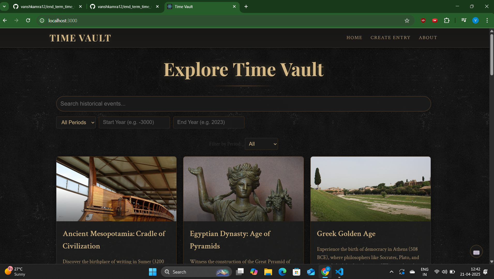
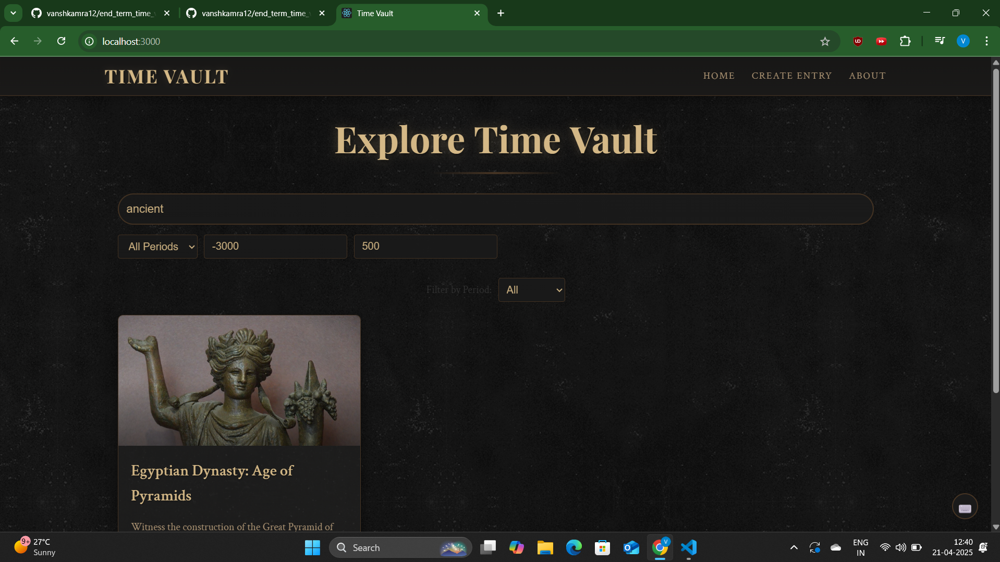
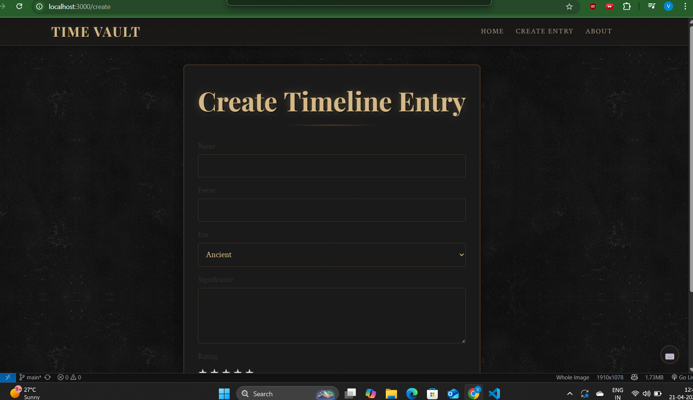
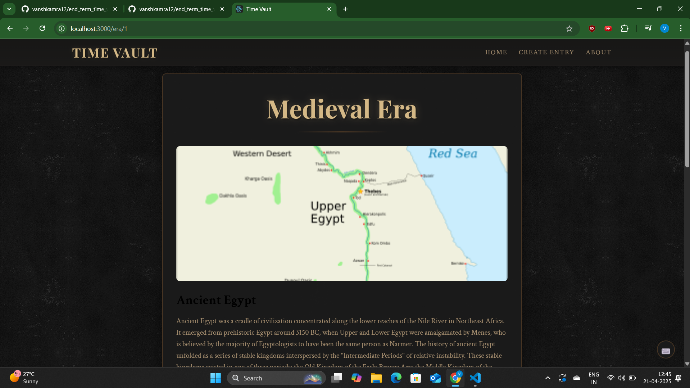

# Time Vault

An interactive timeline exploration application that lets users discover historical events across different eras.

## Features

- Browse historical events across Ancient, Medieval, and Future periods
- Advanced search and filtering capabilities
- Interactive timeline visualization
- Create new historical entries with validation
- Real-time API integration for historical data
- Responsive design for mobile and desktop
- Keyboard shortcuts for quick navigation

## Tech Stack

- React.js (Functional Components + Hooks)
- React Router for navigation
- Context API for state management
- Custom CSS with responsive design
- Axios for API calls
- Environment variables for configuration

## Setup Instructions

1. Clone the repository:
```bash
git clone https://github.com/vanshkamra12/end_term_time_vault
cd time-vault
```

2. Install dependencies:
```bash
npm install
```

3. Create a `.env` file in the root directory:
```env
REACT_APP_HISTORY_API_KEY=your_api_key_here
REACT_APP_HISTORY_API_URL=your_api_url_here
```

4. Start development server:
```bash
npm start
```

5. Build for production:
```bash
npm run build
```

## Project Structure

```
src/
  ├── components/      # Reusable UI components
  ├── contexts/        # React Context providers
  ├── data/           # Static data and configurations
  ├── hooks/          # Custom React hooks
  ├── pages/          # Main route components
  ├── services/       # API and utility services
  └── styles/         # Global styles and CSS modules
```

## Available Scripts

- `npm start`: Run development server
- `npm test`: Run test suite
- `npm run build`: Create production build
- `npm run eject`: Eject from Create React App

## Keyboard Shortcuts

- `Ctrl + H`: Navigate to Home
- `Ctrl + C`: Create new entry
- `Ctrl + A`: About page
- `/`: Focus search
- `ESC`: Clear focus

## Contributing

1. Fork the repository
2. Create your feature branch (`git checkout -b feature/AmazingFeature`)
3. Commit your changes (`git commit -m 'Add some AmazingFeature'`)
4. Push to the branch (`git push origin feature/AmazingFeature`)
5. Open a Pull Request

## License

This project is licensed under the MIT License - see the [LICENSE](LICENSE) file for details.

## Screenshots

### Homepage & Search

The homepage features an elegant search interface with period filtering and advanced search options for exploring historical eras.

### Era Details Page

Detailed view of each historical era with comprehensive information about events, figures, and artifacts.

### Create Entry Form

User-friendly form for adding new historical entries with validation and period selection.

### Timeline Navigation

Interactive timeline interface showing different historical periods and their connections.

## Live Demo
[View Live Demo](https://vanshkamra12.github.io/end_term_time_vault/)
